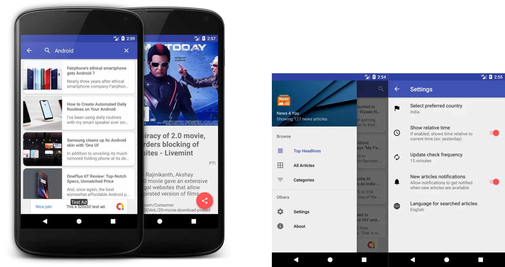

# Capstone_Project
Final Project in Android Developer Nanodegree Udacity. This android app allows you to get instant news updates. Users can read articles based on category or search articles. Periodically app notifies users about new articles.

[Project Document](Capstone_Stage1.pdf)

## Screenshots

## Libraries used
- [Picasso](http://square.github.io/picasso/)
- [NewsAPI.org](https://newsapi.org/)
- [Retrofit](http://square.github.io/retrofit/)
- [Room Library](https://developer.android.com/topic/libraries/architecture/room)
- [Architecture Components](https://developer.android.com/topic/libraries/architecture/)

## Before you build
Please check the 'TODO' items in the project to insert required API Keys

* NewsAPI.org key -> root>gradle.properties
* Google tracking key -> root>app>src>main>res>xml>global_tracker.xml
* Add google_services.json file -> root>app
